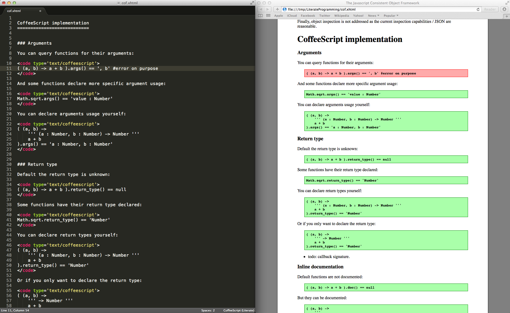

# Literate Programming & JS runtime inspection

This is a little experiment on using literate programming to develop runtime inspection in JavaScript. 

## How to use

Clone this repository. Open index.xhtml in your editor on the left side of the screen, and in your web browser on the right side. Like this.

Edit your thoughts in markdown in the &lt;source&gt; tags. 

Edit the example code in &lt;code&gt; sections. Reload the browser and watch the unit test go green or red. 

Edit the inspection library in the &lt;coffee-script&gt; tag.

*Note:* To see the unit test running, try to scroll down to one and refresh the browser.

That's it!
